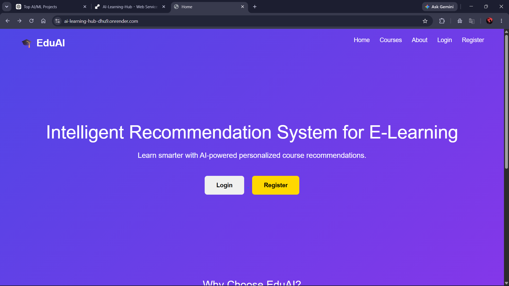
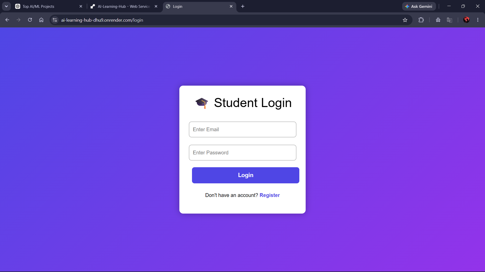
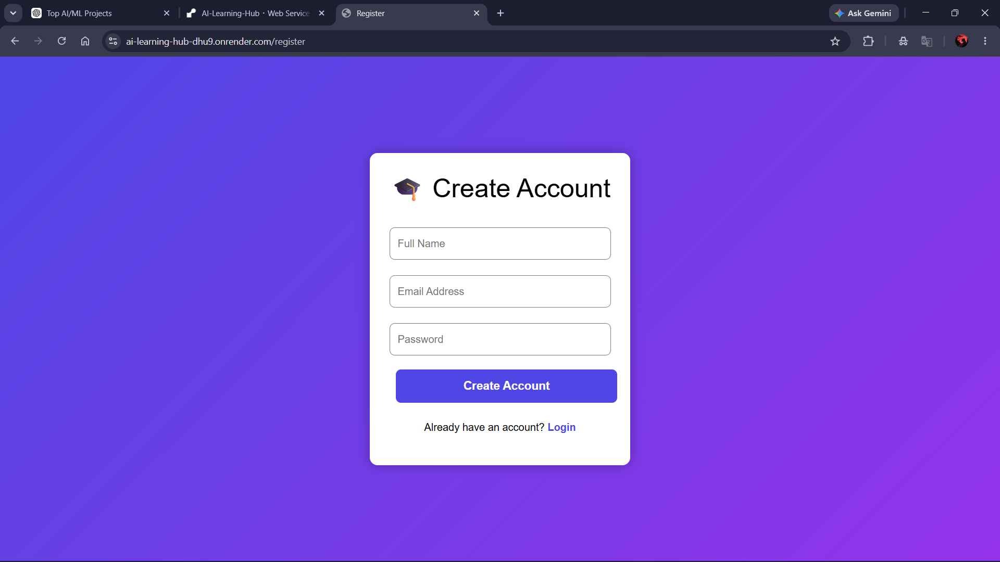
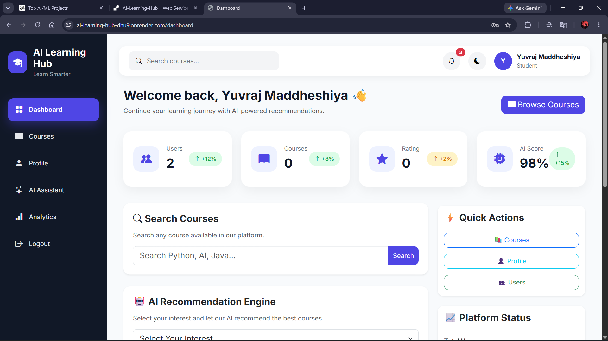
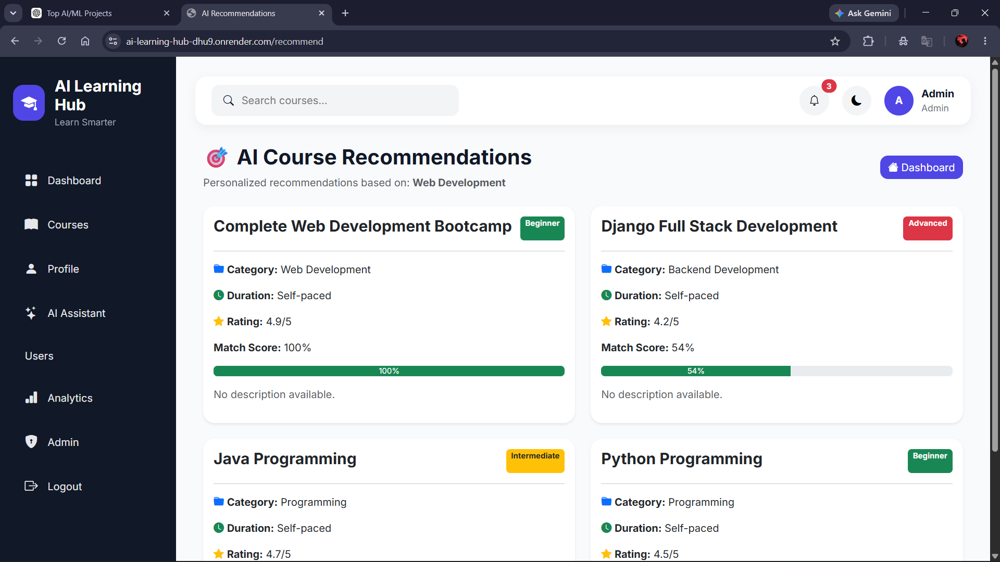
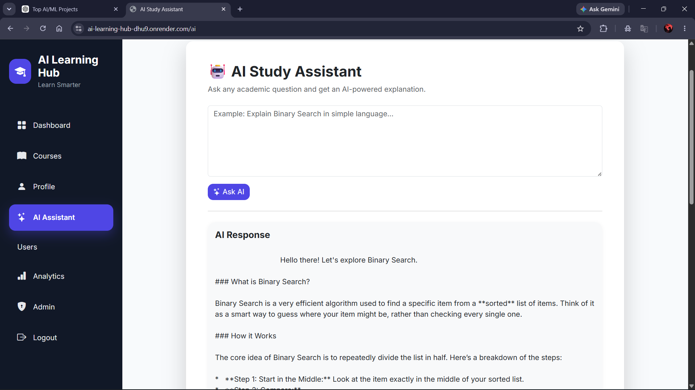
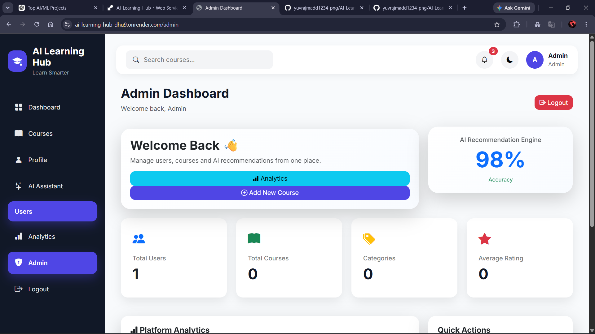
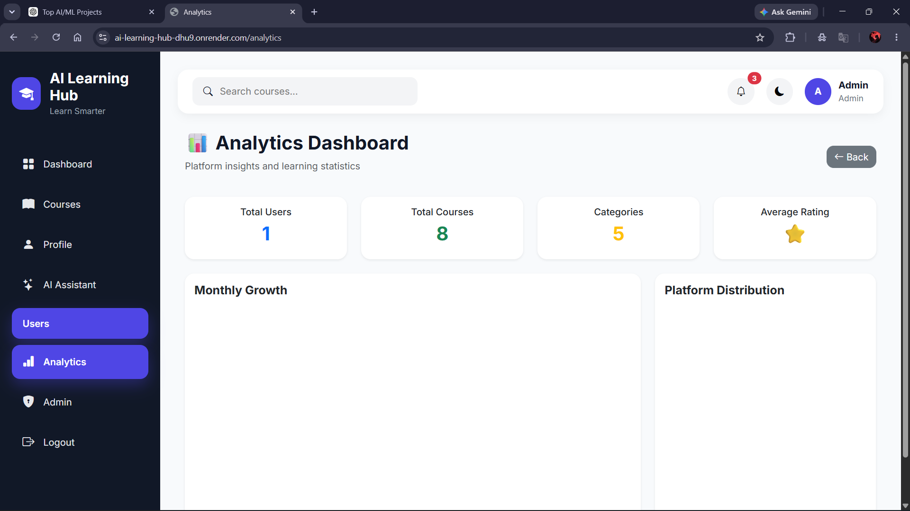

# 🎓 AI Learning Hub

<p align="center">


</p>

<p align="center">

An AI-powered E-Learning Platform with Personalized Course Recommendation and Gemini AI Study Assistant.

</p>

---

# 🌐 Live Demo

### 🚀 https://ai-learning-hub-dhu9.onrender.com

---

# 📌 Project Overview

AI Learning Hub is a modern intelligent e-learning platform that combines Machine Learning and Generative AI to enhance students' learning experience.

The platform allows students to:

- Register/Login securely
- Receive personalized course recommendations
- Learn using an AI Study Assistant powered by Google Gemini
- Manage profiles
- Search learning resources

Administrators can manage users, courses and analytics through a dedicated dashboard.

---

# ✨ Features

## 👨‍🎓 Student Features

- Secure Login & Registration
- Personalized Dashboard
- AI Course Recommendation
- AI Study Assistant
- Profile Management
- Search Courses
- Responsive Design

---

## 👨‍💼 Admin Features

- Admin Dashboard
- User Management
- Course Management
- Analytics Dashboard
- Platform Statistics

---

# 🤖 Gemini AI Study Assistant

Powered by **Google Gemini API**

Students can:

- Explain concepts
- Ask academic questions
- Generate summaries
- Get real-world examples
- Understand difficult topics
- Receive key takeaways

---

# 🛠 Tech Stack

### Backend

- Python
- Flask
- SQLAlchemy
- Flask-Migrate

### Frontend

- HTML5
- CSS3
- Bootstrap 5
- JavaScript

### Database

- SQLite

### Machine Learning

- Scikit-Learn
- TF-IDF Vectorizer
- Cosine Similarity

### AI

- Google Gemini API
- google-genai SDK

---

# 📸 Project Screenshots

<p align="center">













</p>

---

# 📂 Project Structure

```
AI-Learning-Hub/
│
├── routes/
├── services/
├── static/
├── templates/
├── screenshots/
├── models.py
├── utils.py
├── app.py
├── requirements.txt
├── README.md
└── .env
```

---

# ⚙ Installation

```bash
git clone https://github.com/yuvrajmadd1234-png/AI-Learning-Hub.git

cd AI-Learning-Hub

pip install -r requirements.txt

python app.py
```

---

# 🔐 Environment Variables

Create a `.env` file

```env
SECRET_KEY=your_secret_key
GEMINI_API_KEY=your_gemini_api_key
```

---

# 🚀 Future Scope

- PDF Notes Upload
- Quiz Generator
- Flashcard Generator
- Learning Progress Tracker
- Certificate Generation
- Email Verification
- Password Reset

---

# 👨‍💻 Developer

**Yuvraj Maddheshiya**

---

# ⭐ Support

If you like this project, consider giving it a ⭐ on GitHub.